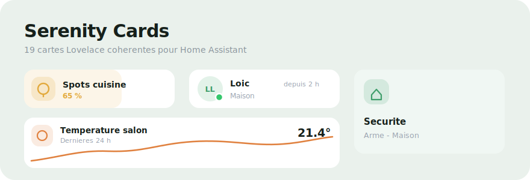

# Serenity Cards



A cohesive suite of **19 Lovelace cards** for Home Assistant, designed for the *Serenity* look: soft accents, rounded plates, French labels and thumb-friendly controls. Everything ships in a single bundle — one resource, sixteen cards.

| Card | Type | What it does |
|---|---|---|
| Title | `custom:serenity-title-card` | Page header: title, greeting/count/state subtitle, action buttons |
| Subtitle | `custom:serenity-subtitle-card` | Section header with divider line and live count |
| Tile | `custom:serenity-tile-card` | Navigation tile with live subtitle, accent glow, alert override |
| Group | `custom:serenity-group-card` | "N sur M allumées" row, tap turns the group off |
| Entity | `custom:serenity-entity-card` | Generic row with French device-class labels and alert tint |
| Light | `custom:serenity-light-card` | Tap toggles, drag dims (card = slider), hold = more-info |
| Scenes | `custom:serenity-scene-card` | Scene chips, last-activated highlighted |
| Person | `custom:serenity-person-card` | Avatar + presence dot, GPS zone, "depuis …" |
| Alerts | `custom:serenity-alerts-card` | Notification centre: stack, expand, dismiss, clear-all |
| Alarm | `custom:serenity-alarm-card` | Alarm status, sensor chips, arm/disarm quick actions |
| Camera | `custom:serenity-camera-card` | Rounded camera view, frosted name chip, motion badge |
| Weather | `custom:serenity-weather-card` | Current conditions + optional 5-day forecast |
| Media | `custom:serenity-media-card` | Artwork, transport controls, draggable volume, player chips |
| Thermostat | `custom:serenity-thermostat-card` | Circular set-point gauge, steppers, temp/humidity stats |
| Climate | `custom:serenity-climate-card` | AC/heat-pump control with popup mode/fan/swing menus |
| Graph | `custom:serenity-graph-card` | Smooth gradient history curve with min/max |
| Cover | `custom:serenity-cover-card` | Up/stop/down, drag-to-position fill |
| Timer | `custom:serenity-timer-card` | Countdown with progress fill and preset chips |
| Temperature / Humidity | `custom:serenity-temperature-card` / `-humidity-card` | Value, history bars, trend |

---

## Install

### HACS (recommended)

1. **HACS → ⋮ → Custom repositories** → add this repo, category **Dashboard**.
2. Install **Serenity Cards**; the resource `/hacsfiles/serenity-cards/serenity-cards.js` is added automatically.
3. After every update: **Redownload** in HACS, then bump the resource URL (`…serenity-cards.js?v=NN`) and hard-refresh — HA caches aggressively.

### Manual

Copy `dist/serenity-cards.js` to `config/www/`, add `/local/serenity-cards.js` as a **JavaScript Module** resource.

---

## Cards

### Title & Subtitle

```yaml
type: custom:serenity-title-card
title: Maison
secondary: greeting            # "Bonjour, Loïc" — or a string, count-spec or entity-spec
buttons:
  - icon: mdi:home
    tap_action: { action: navigate, navigation_path: home }
  - icon: mdi:menu
    tap_action: { action: menu }   # toggles the sidebar
```

```yaml
type: custom:serenity-subtitle-card
title: Portes & fenêtres
secondary:
  entities: [binary_sensor.door_a, binary_sensor.window_b]
  state: "on"
  format: "{n} ouverte{s}"
  format_zero: Tout est fermé
```

`secondary` accepts: a **string**, `greeting`, a **count-spec** (`entities`/`domain` + `state`/`state_not` + `format`/`format_zero`/`format_one`, tokens `{n}` `{s}`), or an **entity-spec** (`{entity, format: "… {state} …", map: {state: label}}`). Button actions: `navigate`, `url`, `more-info`, `toggle`, `menu`. Other options: `label`, `icon`, `accent`, `badge`, `align: center`, `transparent: false`, `tap_action`.

### Tile

```yaml
type: custom:serenity-tile-card
title: Sécurité
icon: mdi:shield-home-outline
accent: "#3F9E6B"
entity: alarm_control_panel.alarmo          # drives the active glow
active_states: [armed_home, armed_away]
subtitle: { entity: alarm_control_panel.alarmo, map: { disarmed: Désactivée } }
alert:                                       # overrides everything when it matches
  entities: [binary_sensor.door_a]
  state: "on"
  format: "{n} ouverture{s} détectée{s}"
  color: "#E06B5B"
tap_action: { action: navigate, navigation_path: security }
```

### Group

```yaml
type: custom:serenity-group-card
title: Rez-de-chaussée
icon: mdi:home-variant
accent: "#E0813F"
entities: [light.a, light.b]
# subtitle: "{n} sur {total} allumée{s} — Appuyer pour éteindre"
# subtitle_zero: Tout éteint
# tap_action: toggle | none      (default: turn_off)
```

### Entity

French labels, icons and alert colours are picked automatically from the `device_class` (door, window, motion, smoke, moisture…). Controllable domains toggle on tap; sensors open more-info.

```yaml
type: custom:serenity-entity-card
entity: binary_sensor.entrance_door_sensor_contact
name: Porte entrée
# full_width: true, labels: {on: …, off: …}, accent, icon, tint: false, show_since: false
```

### Light

The card itself is the slider: **tap** toggles, **drag horizontally** dims with a soft fill, **hold** opens a Serenity popup with a fine slider plus white-temperature and colour presets (`popup: false` restores the native more-info).

```yaml
type: custom:serenity-light-card
entity: light.kitchen_spots
name: Spots cuisine
icon: mdi:light-recessed
# full_width: true, accent: "#E2A93C"
```

### Scenes

```yaml
type: custom:serenity-scene-card
title: Scènes
scenes:
  - { entity: scene.cosy, name: Cosy, icon: mdi:sofa-outline, accent: "#3F9E6B" }
# highlight_last: false    # don't highlight the last-activated scene
```

### Person

The person's state **is** the GPS zone; the card resolves the matching `zone.*` for its real name and icon.

```yaml
type: custom:serenity-person-card
entity: person.loic
show_picture: true
battery_entity: sensor.phone_loic_battery_level   # phone battery pill
distance_entity: sensor.loic_distance             # shown while away
# name, initials, color, show_status: true, show_since: false, home_states
```

### Alerts

Collapsed: newest alert + `+N` pill + layer stack. Expanded: full list, per-alert dismiss (persisted in localStorage, auto-reappears on re-trigger), **Tout effacer**.

```yaml
type: custom:serenity-alerts-card
empty_message: "Vous n'avez aucune alerte !"
door_entities: [...]
window_entities: [...]
ink_entities: [...]          # + ink_threshold (15)
battery_entities: [...]      # + battery_threshold (15)
unavailable_entities: [...]
alerts:                      # custom rules
  - { entity: sensor.x, below: 5, message: "…", icon: mdi:alert, color: "#E0A95B" }
# expanded: true, max_alerts: 8, storage_key, clear_all_label, dismissed_message
# snooze_hours: 8      # X hides for N hours instead of until the state changes
```

### Alarm

```yaml
type: custom:serenity-alarm-card
entity: alarm_control_panel.alarmo
doors: [binary_sensor.door_a, ...]      # chips: N ouvertes / fermées
motion: [binary_sensor.motion_a, ...]   # chips: mouvement / au calme
# actions: [disarm, arm_home, arm_away, arm_night, arm_vacation]
# code: "1234"          # if your panel requires one
# show_actions: false
```

### Camera

```yaml
type: custom:serenity-camera-card
entity: camera.living_net
name: Salon
motion_entity: binary_sensor.living_room_camera_mouvement   # red badge
# live: true            # embedded live stream instead of 10 s stills
# refresh_seconds: 10
```

### Weather

```yaml
type: custom:serenity-weather-card
entity: weather.forecast_maison
name: Maison
show_forecast: false     # hide the 5-day row (tap opens details)
# forecast_days: 5
```

### Media

```yaml
type: custom:serenity-media-card
players:
  - { entity: media_player.nest_cuisine, name: Nest Cuisine }
  - { entity: media_player.shield, name: SHIELD }
# accent: "#3F9E6B"
```

Artwork, title/artist, prev / play-pause / next, draggable volume bar; player chips select the target (the playing one is auto-selected on load).

### Thermostat

```yaml
type: custom:serenity-thermostat-card
entity: climate.thermostat
name: Thermostat
secondary: Maison · Principal
humidity_entity: sensor.salon_humidity   # else current_humidity attribute
# min, max, step, unit, accent, labels: {heating: Chauffe, …}
# show_humidity: false, show_state: false, setpoint_attribute
```

### Climate (AC / heat pump)

Mode button and fan / vertical / horizontal swing chips open **popup menus** (no cycling). Horizontal swing needs `swing_horizontal_modes` (HA 2024.12+).

```yaml
type: custom:serenity-climate-card
entity: climate.ac_salle_a_mange
# accent, step, unit, setpoint_attribute
```

### Graph

```yaml
type: custom:serenity-graph-card
entity: sensor.living_room_thermometer_temperature
name: Température salon
accent: "#E0813F"
hours: 24
# unit, decimals, icon
```

### Cover

```yaml
type: custom:serenity-cover-card
entity: cover.volet_salon
name: Volet salon
# full_width: true, accent, icon — drag to set position, hold = more-info
```

### Timer

```yaml
type: custom:serenity-timer-card
entity: timer.cuisine
name: Minuteur cuisine
presets: [5, 10, 30]     # minutes
# full_width: true, accent, icon
```

### Temperature & Humidity

```yaml
type: custom:serenity-temperature-card
entity: sensor.living_room_thermometer_temperature
name: Living Room
# hours: 12, bars: 24, trend_hours: 3, decimals: 1, secondary_entity
```

---

## Layout

Cards report their size to HA's **sections** grid: person / entity / light / tile default to **half width** (two per row) with content-based height; set `full_width: true` (entity, light) for a full row. Everything works in masonry / stacks too.

## Theming

All colours derive from HA theme variables with Serenity fallbacks, and adapt to dark themes. Override globally:

`--serenity-header-color`, `--serenity-value-color`, `--serenity-muted-color`, `--serenity-header-font`, `--serenity-tile-plate`, `--serenity-tile-bg`, `--serenity-button-bg`, `--serenity-rule-color`, `--serenity-person-home`, `--serenity-thermostat-color`, `--serenity-climate-color`, `--serenity-media-color`, `--serenity-ok-color`.

## Screenshots

Drop your own captures in `docs/` and reference them here — the preview banner above is generated from `docs/preview.svg`.

## Visual editors

Every main card ships a UI editor (pencil in the dashboard editor) built on HA's native `ha-form`. Advanced specs (count-specs, buttons, scenes, custom alert rules) stay YAML-only.

## Development

```bash
npm install
npm run build     # bundles src/ → dist/serenity-cards.js
```

Adding a card = one file in `src/cards/` + one import in `src/main.js`.

MIT licensed.
